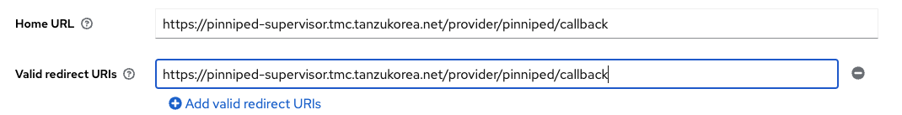
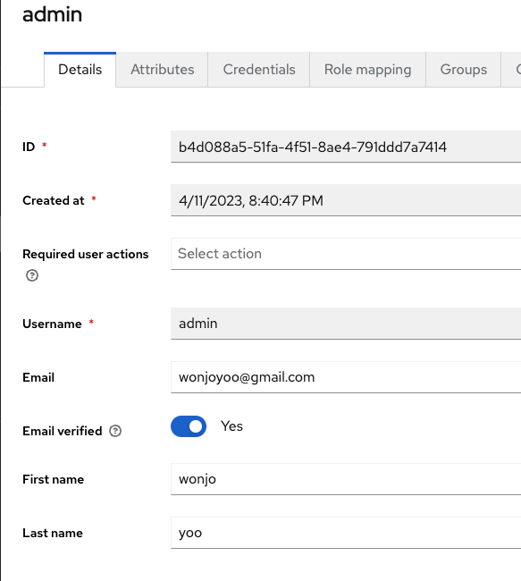
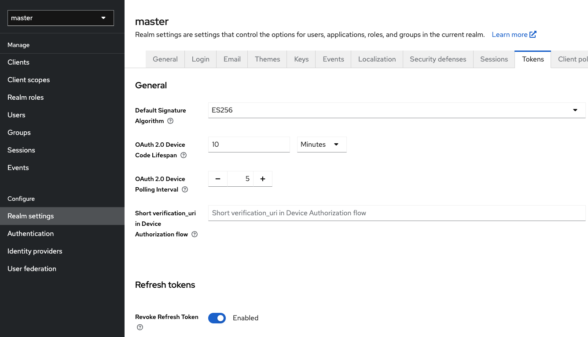

# TMC-SM 설치 가이드
본 가이드는 TMC Self-Managed 를 설치하기 위한 것으로 여기에서 사용하는 도메인명은 tanzukorea.net 으로 각 상황에 맞게 변경해서 설치하시면 됩니다. IAM 으로는 Keycloak을 사용합니다. (vSphere의 계정관리를 사용할 수 있습니다.)

## 1. 사전 준비 사항
1. 파일 다운로드

    [설치 스크립트 다운로드](./files/tmclocal-etc.tar)
    : 설치를 조금 단순화한 스크립트 파일 및 설정파일

    [TMC 1.0 Beta 1 다운로드](https://onevmw-my.sharepoint.com/:u:/g/personal/wyoo_vmware_com/EeIzyTy_DRZPmr_4wTQtvCwBCr_bY-3MS9-r33MQ9oPVNw?e=adQy5s)

2. CA Key 생성

    cd clusterissuer

    ./createca.sh 실행

    CA 파일 생성 (ca.tanzukorea.net.cer, ca.tanzukorea.net.key 생성됨)
    
    
    ```
        openssl req -x509 -newkey rsa:4096 -sha256 -days 365 -nodes \
        -keyout ca.tanzukorea.net.key -out ca.tanzukorea.net.cer \
        -subj /C=KR/ST=MH/L=PUN/O=TanzuKr/OU=Tanzu/CN=*.tanzukorea.net \
        -extensions ext \
        -config <(cat <<EOF
        [req]
        distinguished_name=req
        [ext]
        keyUsage=critical,keyCertSign,cRLSign
        basicConstraints=critical,CA:true,pathlen:1
        subjectAltName=DNS:*.tanzukorea.net
        EOF
        )
    ```
3. TKG 2.1 Cluster(3 node)

    CA 파일을 TKG Mgmt Cluster(나중에 등록을 위해(수정 가능)) 와 Workload Cluster(수정은 안되고 생성시에만 가능)에 모두 적용해야함.

    export TKG_CUSTOM_IMAGE_REPOSITORY_CA_CERTIFICATE=`cat ca.tanzukorea.net.cer |base64 -w0`

    OR
    cat ca.tanzukorea.net.cer |base64 -w0 내용을 아래 data에 추가
    cluster.yaml 파일에서 topology.variables 하위태그로 추가

    ```
        variables:
        - name: trust
        value:
            additionalTrustedCAs:
            - name : imageRepository
            data: LS0tLS1CRUdJTiBDR....
    ```
    tanzu cluster create --file cluster.yaml


## 2. 설치 파일 준비
```
tar -xvf tmclocal-etc.tar
mkdir tmc-local
tar -C tmc-local/ -xvf bundle-1.0.0-beta.1.tar
cd tmc-local
./tmc-local push-images harbor --project harbor.tanzukorea.net/tmc-local --username 계정 --password "" --concurrency 10
```

## 3. DNS서버 설치
```
sudo apt remove bind9-libs
sudo apt install bind9-libs
sudo apt install bind9
sudo apt install bind9 bind9utils bind9-dnsutils bind9-doc bind9-host
sudo apt install dnsutils

sudo su - 
cd /etc/bind/
```

vi db.tanzukorea.net
```
    $ORIGIN .
    $TTL 604800	; 1 week
    tanzukorea.net		IN SOA	tanzukorea.net. root.tanzukorea.net. (
                    88         ; serial
                    604800     ; refresh (1 week)
                    86400      ; retry (1 day)
                    2419200    ; expire (4 weeks)
                    604800     ; minimum (1 week)
                    )
                NS	ns.tanzukorea.net.
                A	10.220.46.7
                AAAA	::1
    $ORIGIN tanzukorea.net.
    alertmanager		A	10.220.46.7
    auth			A	10.220.46.7
    blob			A	10.220.46.7
    console			A	10.220.46.7
    gts			A	10.220.46.7
    gts-rest		A	10.220.46.7
    keycloak		A	10.220.46.7
    landing			A	10.220.46.7
    ns			A	10.220.44.99
    pinniped-supervisor	A	10.220.46.7
    s3			A	10.220.46.7
    console.s3			A	10.220.46.7
    tmc			A	10.220.46.7
    harbor			A	3.38.150.248
```

```
sudo su - 
cd /etc/bind/

vi /etc/bind/named.conf.local
```
아래 내용 추가
```
zone "tanzukorea.net" {
    type master;
    file "/etc/bind/db.tanzukorea.net";
};
```
```
vi /etc/default/named
OPTIONS="-u bind -4"
```
```
sudo systemctl restart bind9.service
```

## 4. jumpbox pc의 dns서버를 local(bind9)로 변경
```
sudo vi /etc/systemd/resolved.conf
[Resolve]
DNS=127.0.0.1
sudo systemctl restart systemd-resolved
```

확인 : nslookup ns.tanzukorea.net


## 5. helm설치
```
curl -fsSL -o get_helm.sh https://raw.githubusercontent.com/helm/helm/main/scripts/get-helm-3
chmod 700 get_helm.sh
./get_helm.sh

kubectl create ns keycloak
kubectl create ns cert-manager
kubectl create ns tmc-local
```

## 6. cert-manager설치
```
helm repo add jetstack https://charts.jetstack.io
helm repo update
kubectl apply -f https://github.com/cert-manager/cert-manager/releases/download/v1.11.1/cert-manager.crds.yaml

helm install \
  cert-manager jetstack/cert-manager \
  --namespace cert-manager \
  --create-namespace \
  --version v1.11.1 
```


## 7. ClusterIssuer 설치

ClusterIssuer 생성
```
cd clusterissuer
./runinstall.sh
```
kubectl get clusterissuer 로 상태 확인 Ready가 되어야 함.


## 8. KeyCloak설치
```
cd keycloak
kubectl apply -f keycloak.yaml
```
http_proxy는 contour(tmc안에 포함되어 있음) 설치 후에 설정할 예정임.

## 9. TKG의 DNS 설정 수정

kubectl -n kube-system edit configmap/coredns
```
apiVersion: v1
data:
  Corefile: |
    tanzukorea.net:53 {
      forward . DNS서버IP
    }
```
kubectl -n kube-system rollout restart deployment coredns


## 10. TMC 설치


1. 설정파일 생성
    ```
    cd tmc-local
    ./tmc-local generate-values-schema --output-file ./values.yaml
    ```

2. values.yaml 수정

    ~/tmclocal-file/values.yaml 파일을 참고하여 수정

    CA파일은 위에서 생성한 ca.tanzukorea.net.cer 의 값을 넣음.


3. 파일 검증
    ```
    ./tmc-local validate-values values.yaml
    ```

4. 설치
    ```
    cp tmclocal-file/*sh tmc-local
    cd tmc-local
    ./runinstall.sh
    ```

5. 설치 도중 바로 아래 실행
    ```
    kubectl get svc -A
    NAMESPACE     NAME                     TYPE           CLUSTER-IP       EXTERNAL-IP   PORT(S)                      AGE
    tmc-local     contour-envoy            LoadBalancer   100.71.194.196   10.220.53.5   80:30175/TCP,443:30703/TCP   8m24s
    ```

6. External-IP를 DNS에 저장

    sudo vi /etc/bind/db.tanzukorea.net
    ```
    sudo systemctl restart bind9.service
    ```

7. keycloak설치

    ```
    cd keycloak
    kubectl apply -f keycloak_httpproxy.yaml
    ```
    local PC에 contour ip로 keycloak.tanzukorea.net 을 설정합니다.
    예:)/etc/hosts

## 11. keycloak 설정

1. https://keycloak.tanzukorea.net 에 접속

1. Group을 하나 만들고 Role(tmc:admin, tmc:member) 을 부여해야함.
2. Client -> Create Client 하고, Client authentication을 ON --> Credentials가 생김 여기에서 Client Secret을 복사

3. Return URL 과 valid redirect URL 에 동일하게 다음 입력  : https://pinniped-supervisor.tanzukorea.net/provider/pinniped/callback



    
4. User의 기본정보를 모두 입력해야 함.

    client scope에서 username, groups, offline_access 에 mappers, 와 scope를 연결해주어야 함. -> Clients에도 scope 추가

5. Realms settings -> Tokens : ES256
        Refresh tokens : check

   

## 12. tmc 재설치
    ```
    ./deleteall.sh
    kubectl delete ns tmc-local
    
    cd clusterissuer
    ./runinstall.sh

    cd ../tmc-local
    ./runinstall.sh
    ```

    UI 접속
    https://tanzukorea.net


## 12. Management Cluster Attach

Mgmt Cluster Attach를 하기 위해서는 다음 두 단계의 과정 필요

1. CA파일 입력
```
kubectl config usecontext mgmtcluster -oyaml
kubectl -n tkg-system get cm kapp-controller-config -oyaml

kubectl -n tkg-system edit cm kapp-controller-config

kapp-controller pod 삭제해서 적용
```


2. coredns 변경
```
kubectl -n kube-system edit configmap/coredns
apiVersion: v1
data:
  Corefile: |
    tanzukorea.net:53 {
      forward . DNS서버주소
    }
```
kubectl -n kube-system rollout restart deployment coredns
